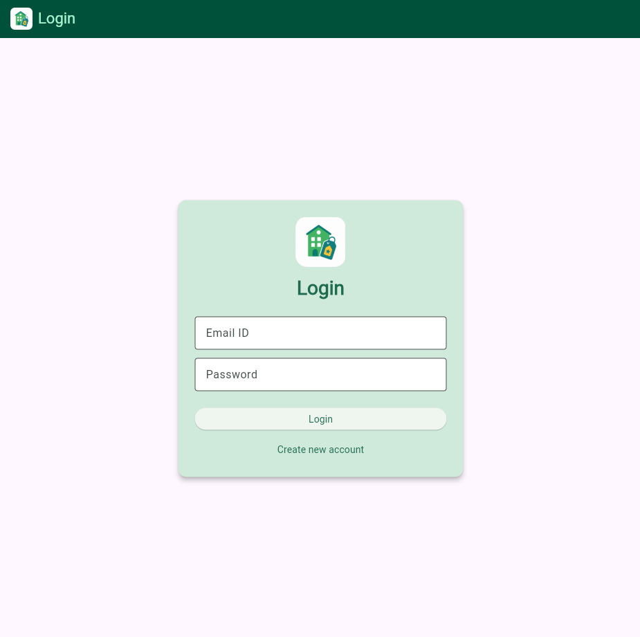
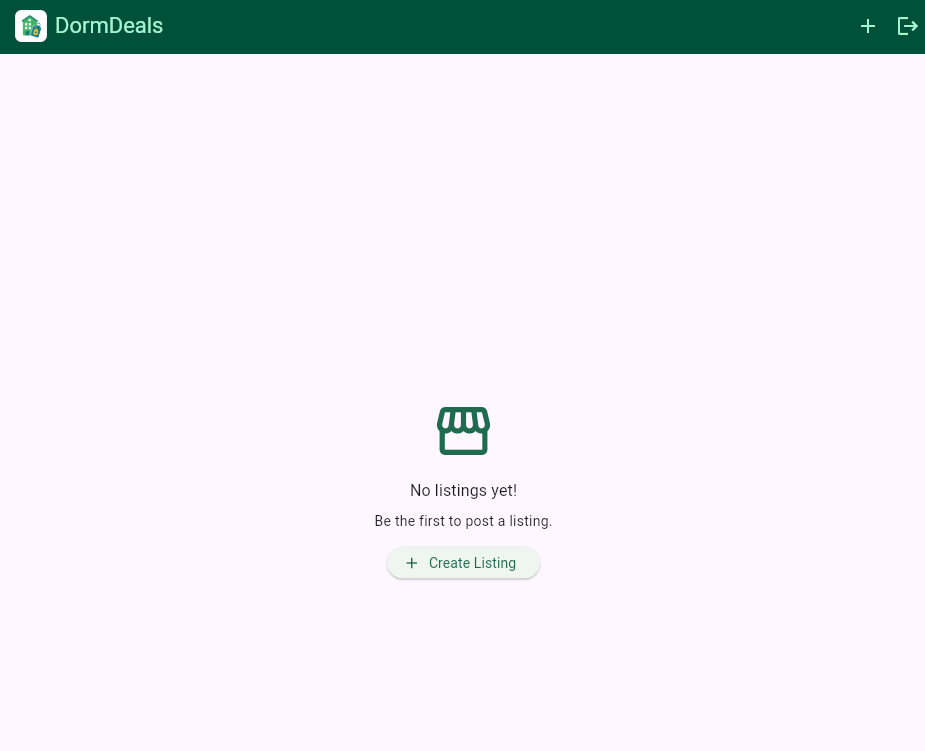

# DormDeals
*Tanvir Singh*

**Where Campus Bargains Live**

DormDeals is a campus-only marketplace app that helps university students buy and sell useful study and university-related items. Instead of using a large public marketplace with unserious buyers and sellers, students can sell things that are directly relevant to campus life, such as textbooks, study notes, stationery, laptops, lab coats, and other uni essentials. Each listing consists of a title, description, price, category, pickup location, seller information, and an optional item photo.

The app is designed as a MVP for a Mobile Application project. It shows how to authenticate users, store databases remotely, perform CRUD operations, and integrate mobile device services. The app allows students to sign up, log in, read listings, make their own, modify or delete them, attach photos, and use their present location for pickup.

## Main Features

- Email and password sign up, login, and logout using Firebase Authentication.
- Users can browse the campus marketplace board which shows listings from Cloud Firestore
- Create listings with title, description, price, category, pickup location, seller details, and with optional photo and location coordinates.
- Read listings from a remote Firebase database.
- Users can update their own listings when signed-in.
- Users can delete their own posted listings with a confirmation dialog.
- Upload listing photos using the device photo picker and Firebase Storage.
- Compress and check selected image size before upload.
- Attach current device location using Geolocator.
- Open saved listing coordinates in Google Maps.
- Seller-only edit and delete controls.
- Input validation for listing title, description, price, and pickup location.
- Responsive listing cards for both Chrome and Android emulator.
- Unit and widget tests for important models, screens, and widgets.

## Screenshots

### Login

### Listings

### Create New Listing

## Technical Details

### Project Structure

- `lib/main.dart` starts Firebase and launches the app.
- `lib/dorm_deals.dart` contains the main DormDeals home screen and empty state.
- `lib/firebase_options.dart` contains FlutterFire configuration.
- `lib/models/listing.dart` contains the listing model, categories, validation, and Firestore conversion.
- `lib/models/user_profile.dart` contains a simple user profile model.
- `lib/state/listing_state.dart` manages listing data using Provider and communicates with Firestore/Storage.
- `lib/widgets/auth_widget.dart` decides whether to show login or the main app.
- `lib/widgets/auth_screen.dart` contains login and sign-up UI.
- `lib/widgets/new_listing.dart` contains the create/edit listing form.
- `lib/widgets/listings_list.dart` displays all listings.
- `lib/widgets/listing_item.dart` displays one listing card.
- `test/` contains unit and widget tests.

### Firebase

DormDeals uses Firebase Authentication for accounts, Cloud Firestore for listing data, and Firebase Storage for uploaded listing images. The app uses image_picker for gallery photo selection and geolocator for current location. The map button opens Google Maps using the saved latitude and longitude that it fetches from the listing.

The app requires internet access. On Android, users may need to allow photo and location permissions when prompted.

## Running and Testing

**Install dependencies:**

cd .\dorm_deals\
flutter pub get

**Run on chrome:**

flutter run -d chrome

**Run on an Android emulator or connected Android device:**

flutter run

**Run tests:**

flutter test

The app has been tested on Chrome and Android emulator (Google Pixel 6a). The final Android APK will be uploaded to the COMP3130 app store provided for this assignment.
I have updated the tests to use fake_cloud_firestore so Firestore-related logic can be tested locally without connecting to the live Firebase project.

### Known Limitation

DormDeals is an MVP after all, so it does not include payments, in-app chat for listing communication, ratings, or saved listings. Location is shown through Google Maps rather than an embedded map. DormDeals was also not tested on IOS and Windows so support is not confirmed for those devices.
